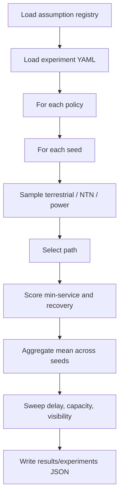

# Activity — RQ3 experiment (current)

```mermaid
flowchart TD
  A[Load assumption registry] --> B[Load experiment YAML]
  B --> C[For each policy]
  C --> D[For each seed]
  D --> E[Sample terrestrial / NTN / power]
  E --> F[Select path]
  F --> G[Score min-service and recovery]
  G --> H[Aggregate mean across seeds]
  H --> I[Sweep delay, capacity, visibility]
  I --> J[Write results/experiments JSON]
```
