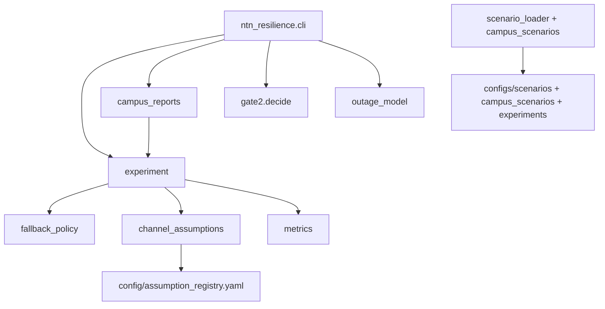

# Component — current

```mermaid
flowchart TB
  CLI[ntn_resilience.cli]
  SCEN[scenario_loader + campus_scenarios]
  EXP[experiment]
  POL[fallback_policy]
  CH[channel_assumptions]
  OUT[outage_model]
  MET[metrics]
  REP[campus_reports]
  G2[gate2.decide]
  REG[config/assumption_registry.yaml]
  YAML[configs/scenarios + campus_scenarios + experiments]
  CLI --> EXP
  CLI --> REP
  CLI --> G2
  EXP --> POL
  EXP --> CH
  EXP --> MET
  CH --> REG
  REP --> EXP
  SCEN --> YAML
  CLI --> OUT
```
