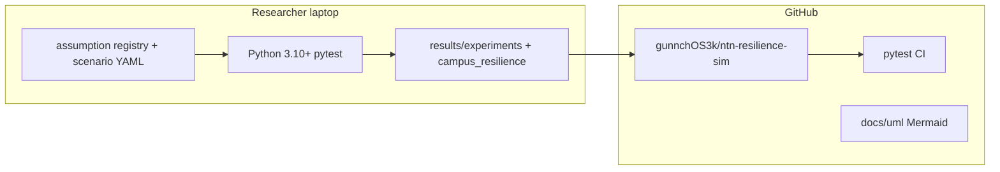

# Deployment — current

```mermaid
flowchart LR
  subgraph local [Researcher laptop]
    PY[Python 3.10+ pytest]
    YAML[assumption registry + scenario YAML]
    RES[results/experiments + campus_resilience]
  end
  subgraph github [GitHub]
    REPO[gunnchOS3k/ntn-resilience-sim]
    GHA[pytest CI]
    UML[docs/uml Mermaid]
  end
  PY --> RES
  YAML --> PY
  RES --> REPO
  REPO --> GHA
```

No satellite gateway, no operator NOC, no Oulu lab deployment is claimed.
