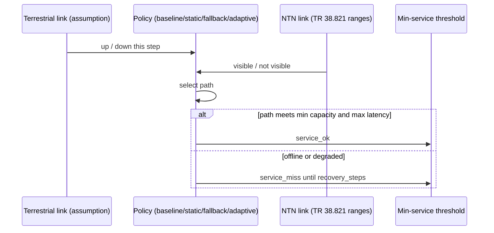

# Sequence — terrestrial / NTN failover (current)

```mermaid
sequenceDiagram
  participant T as Terrestrial link (assumption)
  participant P as Policy (baseline/static/fallback/adaptive)
  participant N as NTN link (TR 38.821 ranges)
  participant S as Min-service threshold
  T->>P: up / down this step
  N->>P: visible / not visible
  P->>P: select path
  alt path meets min capacity and max latency
    P->>S: service_ok
  else offline or degraded
    P->>S: service_miss until recovery_steps
  end
```

Delay, capacity, and visibility are sweep parameters from the assumption registry, not measured operator traces.
