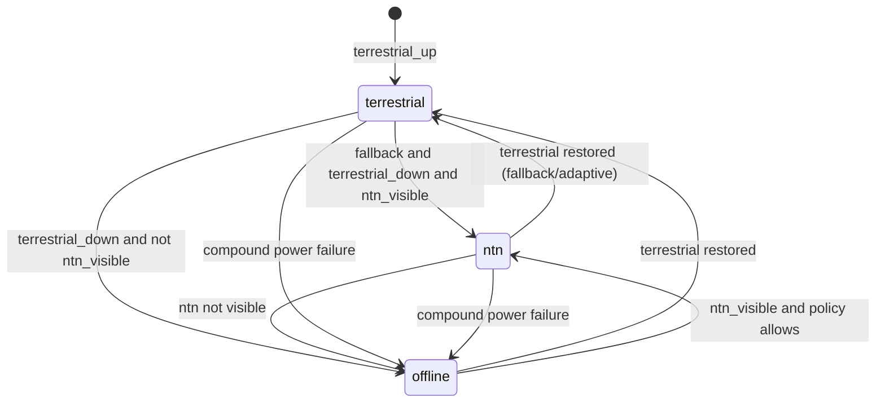

# State machine — connectivity (current)

```mermaid
stateDiagram-v2
  [*] --> terrestrial: terrestrial_up
  terrestrial --> ntn: fallback and terrestrial_down and ntn_visible
  terrestrial --> offline: terrestrial_down and not ntn_visible
  ntn --> terrestrial: terrestrial restored (fallback/adaptive)
  ntn --> offline: ntn not visible
  offline --> terrestrial: terrestrial restored
  offline --> ntn: ntn_visible and policy allows
  terrestrial --> offline: compound power failure
  ntn --> offline: compound power failure
```

`terrestrial_baseline` never enters `ntn`. `static_ntn` prefers `ntn` when visible.
