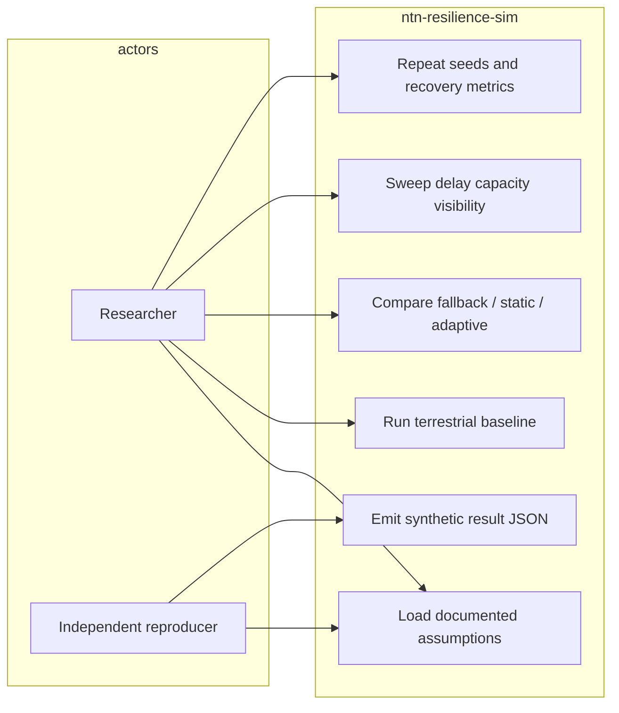

# Use case — current

```mermaid
flowchart LR
  subgraph actors
    R[Researcher]
    I[Independent reproducer]
  end
  subgraph ntn [ntn-resilience-sim]
    UC1[Load documented assumptions]
    UC2[Run terrestrial baseline]
    UC3[Compare fallback / static / adaptive]
    UC4[Sweep delay capacity visibility]
    UC5[Repeat seeds and recovery metrics]
    UC6[Emit synthetic result JSON]
  end
  R --> UC1
  R --> UC2
  R --> UC3
  R --> UC4
  R --> UC5
  I --> UC1
  I --> UC6
```

No use case is “report operator SLA”.
