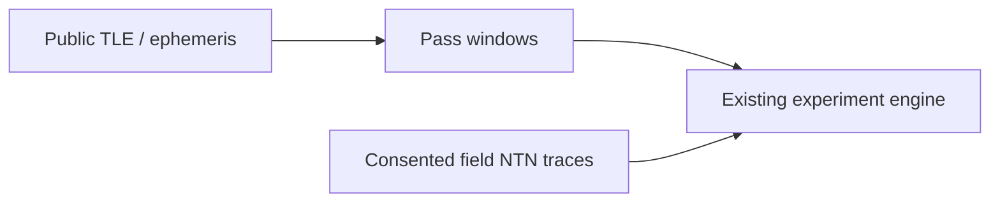

# Future — orbit-accurate visibility

```mermaid
flowchart LR
  TLE[Public TLE / ephemeris] --> VIS[Pass windows]
  VIS --> SIM[Existing experiment engine]
  MEAS[Consented field NTN traces] --> SIM
```

Not implemented in default `make reproduce`.
